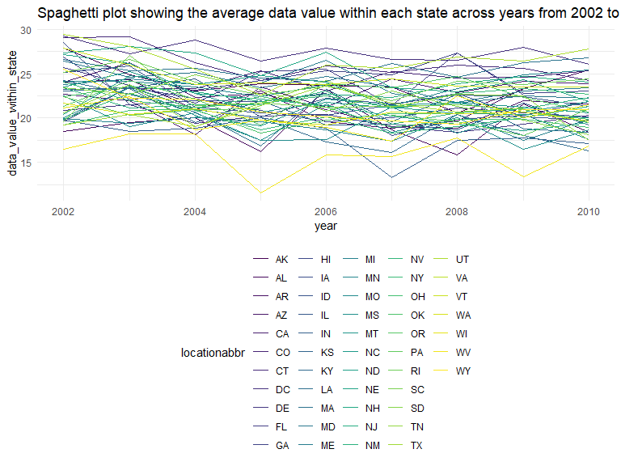
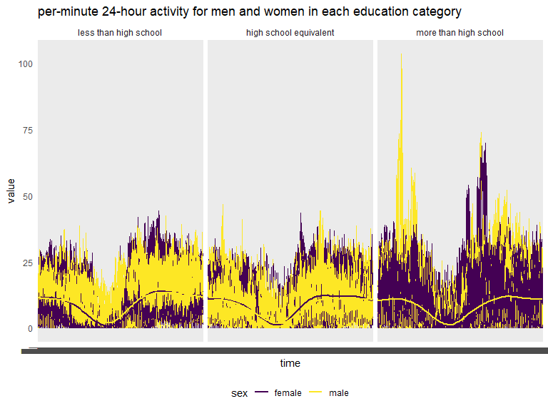

P8105_hw3_rl3328
================
Ruixi Li
2023-10-06

This assignment reinforces ideas in Visualization and EDA.

# Problem 1

load data

``` r
data("instacart")
```

description

``` r
instacart = 
  instacart |> 
  as_tibble()
```

### Answer questions about the data

This dataset contains 1384617 rows and 15 columns, with each row
resprenting a single product from an instacart order. Variables include
identifiers for user, order, and product; the order in which each
product was added to the cart. There are several order-level variables,
describing the day and time of the order, and number of days since prior
order. Then there are several item-specific variables, describing the
product name (e.g. Yogurt, Avocado), department (e.g. dairy and eggs,
produce), and aisle (e.g. yogurt, fresh fruits), and whether the item
has been ordered by this user in the past. In total, there are 39123
products found in 131209 orders from 131209 distinct users.

Below is a table summarizing the number of items ordered from aisle. In
total, there are 134 aisles, with fresh vegetables and fresh fruits
holding the most items ordered by far.

``` r
instacart |> 
  count(aisle) |> 
  arrange(desc(n))
```

    ## # A tibble: 134 × 2
    ##    aisle                              n
    ##    <chr>                          <int>
    ##  1 fresh vegetables              150609
    ##  2 fresh fruits                  150473
    ##  3 packaged vegetables fruits     78493
    ##  4 yogurt                         55240
    ##  5 packaged cheese                41699
    ##  6 water seltzer sparkling water  36617
    ##  7 milk                           32644
    ##  8 chips pretzels                 31269
    ##  9 soy lactosefree                26240
    ## 10 bread                          23635
    ## # ℹ 124 more rows

Next is a plot that shows the number of items ordered in each aisle,
limiting this to aisles with more than 10000 items ordered. Arrange
aisles sensibly, and organize your plot so others can read it.

``` r
instacart |> 
  count(aisle) |> 
  filter(n > 10000) |> 
  mutate(aisle = fct_reorder(aisle, n)) |> 
  ggplot(aes(x = aisle, y = n)) + 
  geom_point() + 
  labs(title = "Number of items ordered in each aisle") +
  theme(
    axis.text.x = element_text(angle = 60, hjust = 1))
```


Our next table shows the three most popular items in aisles
`baking ingredients`, `dog food care`, and `packaged vegetables fruits`,
and includes the number of times each item is ordered in your table.

``` r
instacart |> 
  filter(aisle %in% c("baking ingredients", "dog food care", "packaged vegetables fruits")) |>
  group_by(aisle) |> 
  count(product_name) |> 
  mutate(rank = min_rank(desc(n))) |> 
  filter(rank < 4) |> 
  arrange(desc(n)) |>
  knitr::kable()
```

| aisle                      | product_name                                  |    n | rank |
|:---------------------------|:----------------------------------------------|-----:|-----:|
| packaged vegetables fruits | Organic Baby Spinach                          | 9784 |    1 |
| packaged vegetables fruits | Organic Raspberries                           | 5546 |    2 |
| packaged vegetables fruits | Organic Blueberries                           | 4966 |    3 |
| baking ingredients         | Light Brown Sugar                             |  499 |    1 |
| baking ingredients         | Pure Baking Soda                              |  387 |    2 |
| baking ingredients         | Cane Sugar                                    |  336 |    3 |
| dog food care              | Snack Sticks Chicken & Rice Recipe Dog Treats |   30 |    1 |
| dog food care              | Organix Chicken & Brown Rice Recipe           |   28 |    2 |
| dog food care              | Small Dog Biscuits                            |   26 |    3 |

Finally is a table showing the mean hour of the day at which Pink Lady
Apples and Coffee Ice Cream are ordered on each day of the week. This
table has been formatted in an untidy manner for human readers. Pink
Lady Apples are generally purchased slightly earlier in the day than
Coffee Ice Cream, with the exception of day 5.

``` r
instacart |>
  filter(product_name %in% c("Pink Lady Apples", "Coffee Ice Cream")) |>
  group_by(product_name, order_dow) |>
  summarize(mean_hour = mean(order_hour_of_day)) |>
  pivot_wider(
    names_from = order_dow, 
    values_from = mean_hour) |>
  knitr::kable(digits = 2)
```

| product_name     |     0 |     1 |     2 |     3 |     4 |     5 |     6 |
|:-----------------|------:|------:|------:|------:|------:|------:|------:|
| Coffee Ice Cream | 13.77 | 14.32 | 15.38 | 15.32 | 15.22 | 12.26 | 13.83 |
| Pink Lady Apples | 13.44 | 11.36 | 11.70 | 14.25 | 11.55 | 12.78 | 11.94 |

I did Problem by myself, but after comparing it with Professor Jeff’s
answer, I think his is more concise and logical. So, I changed my
answer.

# Problem 2

``` r
data("brfss_smart2010") 
brfss_smart2010 = brfss_smart2010 |> as.tibble()
```

## data cleaning

format the data to use appropriate variable names; focus on the “Overall
Health” topic include only responses from “Excellent” to “Poor” organize
responses as a factor taking levels ordered from “Poor” to “Excellent”

``` r
res_order =c("Excellent","Very good","Good","Fair","Poor")
brfss_smart2010 = brfss_smart2010 |> 
  janitor::clean_names() |> 
  filter(topic == "Overall Health" & response %in% res_order) |> arrange(factor(response, levels = res_order))
```

## answer questions

1.  In 2002, which states were observed at 7 or more locations? What
    about in 2010?

``` r
a = brfss_smart2010 |>filter(year == 2002) |> group_by(locationabbr,locationdesc) |> summarise(n=n()) |>
  arrange(desc(n))
```

    ## `summarise()` has grouped output by 'locationabbr'. You can override using the
    ## `.groups` argument.

``` r
b = brfss_smart2010 |>filter(year == 2002) |> group_by(locationabbr) |> summarise(n=n()) |>
  arrange(desc(n))
b1 = b |> filter((n/5) >= 7) 
```

- I found that every location(with county) appears 5 times per year in
  this dataset. So, I can calculate how many locations a state was
  observed by knowing the times each state appears per year.
- In 2002, 6 states were observed at 7 or more locations, they are PA,
  MA, NJ, CT, FL, NC.

``` r
c = brfss_smart2010 |>filter(year == 2010) |> group_by(locationabbr,locationdesc) |> summarise(n=n()) |>
  arrange(desc(n))
```

    ## `summarise()` has grouped output by 'locationabbr'. You can override using the
    ## `.groups` argument.

``` r
d = brfss_smart2010 |>filter(year == 2010) |> group_by(locationabbr) |> summarise(n=n()) |>
  arrange(desc(n))
d1 = d |> filter((n/5) >= 7)
```

- Similarly, in 2010, 14 states were observed at 7 or more locations,
  they are FL, NJ, TX, CA, MD, NC, NE, WA, MA, NY, OH, CO, PA, SC.

2.  Construct a dataset that is limited to Excellent responses, and
    contains, year, state, and a variable that averages the data_value
    across locations within a state. Make a “spaghetti” plot of this
    average value over time within a state (that is, make a plot showing
    a line for each state across years – the geom_line geometry and
    group aesthetic will help).

``` r
brfss = brfss_smart2010 |> 
  filter(response == "Excellent") |>
  group_by(year,locationabbr) |>
  summarise(data_value_within_state = mean(data_value,rm.na = T)) 


gp = brfss |>
  ggplot(aes(x = year, y = data_value_within_state, color= locationabbr, group = locationabbr)) + geom_line()+
  labs(title = "Average data value within each state across years from 2002 to 2010")

print(gp)
```



3.  Make a two-panel plot showing, for the years 2006, and 2010,
    distribution of data_value for responses (“Poor” to “Excellent”)
    among locations in NY State

``` r
brfss_smart2010 |> 
  filter(year %in% c(2006,2010) & locationabbr == "NY") |>
  group_by(year,response, locationdesc) |> 
  summarize(mean = mean(data_value, rm.na=T)) |>
  mutate(response = forcats::fct_relevel(response, res_order)) |>
  ggplot(aes(x = response, y = mean)) +
  geom_boxplot(alpha = .5) +
  facet_grid(. ~ year) +
  labs(title = "distribution of data_value for responses (“Poor” to “Excellent”) among locations in NY State for 2006 and 2010") +
  theme(
    axis.text.x = element_text(angle = 60, hjust = 1))
```


# Problem 3

## data cleaning

1.  Load, tidy, merge, and otherwise organize the data sets. Your final
    dataset should include all originally observed variables; exclude
    participants less than 21 years of age, and those with missing
    demographic data; and encode data with reasonable variable classes
    (i.e. not numeric, and using factors with the ordering of tables and
    plots in mind).

``` r
demo = read_csv("./hw3_data/nhanes_covar.csv") |>
  janitor::row_to_names(row_number = 4) |>
  janitor::clean_names() |>
  filter(age >= 21) |>
  drop_na() |>
  mutate(
    sex = recode(sex, "1" = "male", "2" = "female"),
    education = recode(education, "1" = "less than high school", "2" = "high school equivalent", "3" = "more than high school"),
    education = forcats::fct_relevel(education, c("less than high school","high school equivalent","more than high school")),
    age = as.numeric(age))

accel = read_csv("./hw3_data/nhanes_accel.csv") |>
  janitor::clean_names()|>
  mutate(seqn = as.character(seqn))
```

2.  Produce a reader-friendly table for the number of men and women in
    each education category, and create a visualization of the age
    distributions for men and women in each education category. Comment
    on these items.

``` r
table(demo$sex,demo$education) |>
  knitr::kable()
```

|        | less than high school | high school equivalent | more than high school |
|:-------|----------------------:|-----------------------:|----------------------:|
| female |                    28 |                     23 |                    59 |
| male   |                    27 |                     35 |                    56 |

``` r
demo |>
  ggplot(aes(x = age, fill = sex)) +
  geom_density(alpha = 0.5) +
  facet_grid(. ~ education) +
  labs(title = "visualization of the age distributions for men and women in each education category")
```


``` r
demo |>
  ggplot(aes(x = age, y = education, color = sex)) +
  geom_density_ridges(scale = 0.6,alpha=.5) +
  labs(title = "visualization of the age distributions for men and women in each education category")
```


\* I used two methods to visualize … \* For the table: Compared to
males, female participants have lower proportion of high school
equivalent education; People with more than high school education
constitutes about half of all participants in this study. \* For age
distribution plot: Overall, age distribution is more sparse in males
than females. Male participants have have two peak in age density plot
across all educational levels whereas female only have two peaks in
“more than high school” education level. Males have similar age
distribution across different educational levels. Female have more elder
participants(aged 75 or more) among “less than high school & high school
equivalent” levels but have more younger participants(about 30) in “more
than high school” education level.

3.  Traditional analyses of accelerometer data focus on the total
    activity over the day. Using your tidied dataset, aggregate across
    minutes to create a total activity variable for each participant.
    Plot these total activities (y-axis) against age (x-axis); your plot
    should compare men to women and have separate panels for each
    education level. Include a trend line or a smooth to illustrate
    differences. Comment on your plot.

``` r
#convert to long format
accel_long =  accel |>
  pivot_longer(
    -seqn,
    names_to = "time",
    values_to = "value"
  ) 
# merge
demo_accel = left_join(demo, accel_long, by = "seqn")
# plot
demo_accel |>
  group_by(seqn,age,sex,education) |>
  summarise(total_act = sum(value)) |>
  ggplot(aes(x = age, y = total_act, color = sex)) +
  geom_smooth(aes(group =sex), se = FALSE) +
  facet_grid(. ~ education) + 
  labs(title = "total activity against age for men and women in each education category")
```


\* In “less than high school” level,females have higher total activity
than males in their early age(before 40) but have lower total activity
than males in their later age(after 40); In “high school equivalent”
level, females have lower total activity than males in their early
age(before 25) but have higher total activity than males in their later
age(after 25). Most of the time for females who have “high school
equivalent” or “more than high school” , they have higher total activity
than males.

4.  Accelerometer data allows the inspection activity over the course of
    the day. Make a three-panel plot that shows the 24-hour activity
    time courses for each education level and use color to indicate sex.
    Describe in words any patterns or conclusions you can make based on
    this graph; including smooth trends may help identify differences

``` r
demo_accel |>
  ggplot(aes(x = time, y = value, group=seqn, color = sex)) +
  geom_line() +
  geom_smooth(aes(group =sex), se = FALSE) +
  facet_grid(. ~ education) +
  labs(title = "per-minute 24-hour activity for men and women in each education category")
```



- Nearly all participants follow a normal “sleep at night and act at
  daytime” activity pattern. For “less than high school” and “high
  school equivalent” levels, females and males share very similar
  pattern and magnitute of per minute activity. For “more than high
  school” level, males have higher per minute activity in the morning
  whereas females tend to have higher per minute activity in the
  afternoon.
